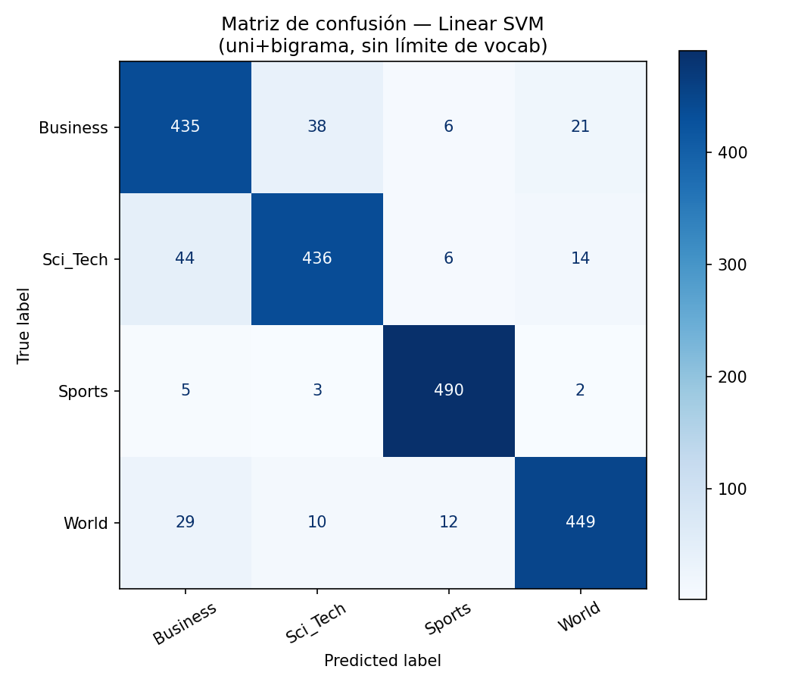

# Checkpoint 3 — Clasificador Supervisado con TF-IDF (AG News)

## Descripción

Tercer checkpoint del Proyecto Final: pipeline de clasificación de texto con
Machine Learning clásico. Reutiliza el preprocesamiento (limpieza Regex +
lematización con SpaCy) desarrollado en el Módulo 2, agrega vectorización
TF-IDF y entrena/evalúa un clasificador baseline sobre el mismo corpus
AG News.

## Estructura del repositorio

```
checkpoint3/
├── data/
│   ├── ag_news_train.csv
│   └── ag_news_test.csv
├── src/
│   └── pipeline_clasificador.py
├── confusion_matrix.png
├── classification_report.txt
├── summary.json
├── requirements.txt
└── README.md
```

## Cómo ejecutar

```bash
pip install -r requirements.txt
python -m spacy download en_core_web_sm
python src/pipeline_clasificador.py
```

## Prevención de Data Leakage

`ag_news_train.csv` y `ag_news_test.csv` ya vienen separados por la cátedra.
El `TfidfVectorizer` se ajusta (`fit_transform`) **únicamente sobre train**;
sobre test se aplica solo `transform`, reutilizando el vocabulario aprendido
en entrenamiento. En ningún punto del pipeline el modelo ve texto crudo ni
vocabulario del set de test antes de la evaluación final.

## Experimentación de vectorización

Se probaron 4 configuraciones de `TfidfVectorizer` (fijando Logistic
Regression como clasificador de referencia para poder comparar
"manzanas con manzanas"):

| Configuración | Tamaño de vocabulario | Accuracy | F1-macro |
|---|---|---|---|
| Unigramas, sin límite | 17.530 | 0.8970 | 0.8969 |
| Unigramas, `max_features=5000` | 5.000 | 0.8960 | 0.8960 |
| Uni+bigramas, sin límite | 155.032 | 0.8980 | 0.8978 |
| Uni+bigramas, `max_features=5000` | 5.000 | 0.8930 | 0.8931 |

**Elegida:** uni+bigramas sin límite de vocabulario (mejor F1-macro), aunque
con una salvedad importante: su vocabulario (155k términos, sobre solo 8.000
documentos de entrenamiento) es órdenes de magnitud más grande que las
alternativas, y la ganancia de F1 frente a la opción de unigramas simples
(17.530 términos) es marginal (+0.0009). En un entorno de producción real,
con restricciones de memoria o donde el corpus vaya a crecer, la
configuración de **unigramas con `max_features=5000`** sería preferible: pierde
solo ~0.001 de F1-macro y reduce el vocabulario en un 97%, mitigando el
riesgo de overfitting sobre términos raros que menciona la consigna. Se
documenta la elección "sin límite" acá porque el checkpoint pide explorar y
reportar el trade-off, no necesariamente adoptar la opción más liviana.

## Justificación del modelo elegido

Se compararon tres baselines clásicos con la mejor configuración de TF-IDF:

| Modelo | Accuracy | F1-macro |
|---|---|---|
| Naive Bayes (Multinomial) | 0.9045 | 0.9046 |
| Logistic Regression | 0.8980 | 0.8978 |
| **Linear SVM** | **0.9050** | **0.9049** |

Se eligió **Linear SVM (`LinearSVC`)** como baseline final, aunque por un
margen muy chico sobre Naive Bayes (+0.0003 de F1-macro). La razón para
preferirlo sobre Naive Bayes, más allá del resultado puntual en este split,
es conceptual: Naive Bayes asume independencia condicional entre features
dado el label (supuesto que TF-IDF con bigramas viola explícitamente, ya que
los bigramas son covariantes por construcción con sus unigramas), mientras
que SVM Lineal no hace esa suposición y en la práctica suele generalizar
mejor en datasets de texto de alta dimensionalidad dispersa como este. Se
descartó Logistic Regression pese a ser competitivo, por quedar último de
los tres en ambas métricas.

## Resultados — Classification Report (Linear SVM)

```
              precision    recall  f1-score   support

    Business     0.8480    0.8700    0.8588       500
    Sci_Tech     0.8953    0.8720    0.8835       500
      Sports     0.9533    0.9800    0.9665       500
       World     0.9239    0.8980    0.9108       500

    accuracy                         0.9050      2000
   macro avg     0.9051    0.9050    0.9049      2000
weighted avg     0.9051    0.9050    0.9049      2000
```

## Análisis preliminar — matriz de confusión



**Categorías más difíciles de predecir:** `Business` y `Sci_Tech` concentran
la mayoría de los errores del modelo, confundiéndose mutuamente en ambas
direcciones (Sci_Tech→Business: 44 casos; Business→Sci_Tech: 38 casos — juntos
representan más de la mitad de todos los errores del modelo). Esto es
consistente con el solapamiento de vocabulario esperable entre ambos dominios:
noticias sobre empresas tecnológicas (adquisiciones, cotizaciones en bolsa,
resultados trimestrales de compañías como Microsoft o Google) usan un léxico
financiero casi idéntico al de noticias puramente de Business. `World`
también se confunde de forma no despreciable con `Business` (29 casos) —
noticias de política internacional con impacto económico (sanciones,
comercio, precios del petróleo) atraviesan ambas categorías.

En el otro extremo, **`Sports` es la categoría mejor predicha por lejos**
(recall 0.98, F1 0.9665): su vocabulario (equipos, jugadores, resultados
deportivos) es el más distintivo y con menor solapamiento léxico frente a
las otras tres clases.

**Implicancia para el pipeline:** un modelo puramente TF-IDF, que solo ve
co-ocurrencia de palabras sin contexto semántico profundo, tiene un techo
natural en la frontera Business/Sci_Tech. Esta limitación es justamente la
motivación para el Módulo 4, donde un modelo basado en Transformers
(con mejor comprensión de contexto) debería reducir esta confusión
específica.

## Requisitos técnicos verificados

- ✅ Splits train/test provistos por la cátedra, sin re-mezclarlos.
- ✅ `fit_transform` solo en train, `transform` en test — sin Data Leakage.
- ✅ Reutilización del preprocesamiento del Módulo 2 (limpieza Regex +
  lematización SpaCy), con remoción de stop-words antes de vectorizar.
- ✅ Experimentación documentada con `max_features` y `ngram_range`.
- ✅ `classification_report` completo + matriz de confusión graficada.
